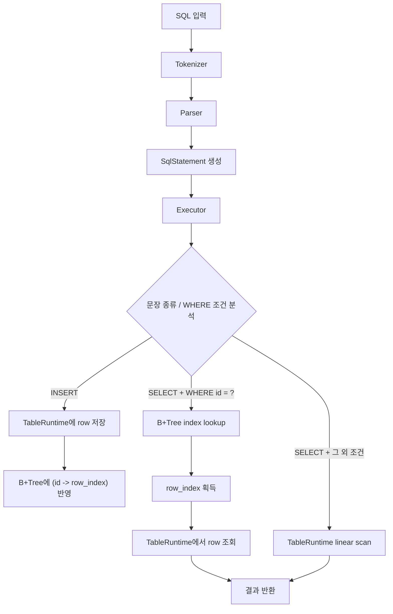
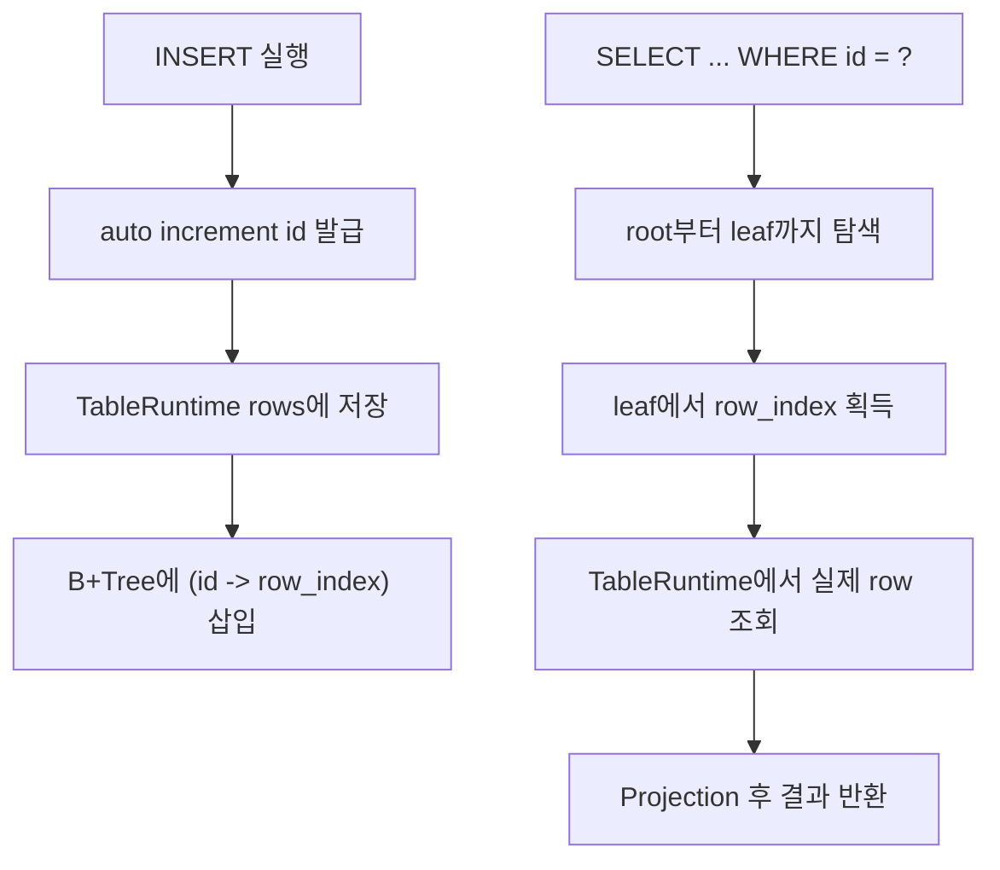

# B+Tree 기반 ID 인덱스를 연동한 SQL Processor

## 1. 프로젝트 한 줄 소개
**이 프로젝트는 기존 SQL 처리기에 B+Tree 기반 인덱스를 실제로 연결해 `WHERE id = ?` 조회 성능을 개선한 구현이다.**

핵심은 자료구조만 따로 만든 것이 아니라, `INSERT`와 `SELECT` 실행 경로 안에 인덱스를 통합했다는 점이다.  
즉, SQL을 파싱하고 실행하는 전체 흐름 속에서 인덱스가 실제로 동작하도록 만든 프로젝트다.

## 2. 성능 비교 결과
인덱스 유지 비용 때문에 삽입은 느려졌지만, `WHERE id = ?` 같은 조건에서 조회 성능은 크게 개선되었다.  


## 3. 프로젝트 구조
발표에서 중요한 파일만 역할 중심으로 정리하면 아래와 같다.

```text
week7_index/
├── src/
│   ├── main.c            # 프로그램 진입점, REPL / 파일 입력 / benchmark 모드 분기
│   ├── tokenizer.c/h     # SQL 문자열을 토큰 단위로 분해
│   ├── parser.c/h        # 토큰을 SqlStatement 구조로 변환
│   ├── executor.c/h      # 문장 종류를 판별하고 인덱스 사용 여부를 결정
│   ├── table_runtime.c/h # 메모리 기반 테이블, auto increment id, row 저장, 선형 탐색
│   ├── bptree.c/h        # id -> row_index를 저장하는 B+Tree 인덱스
│   ├── benchmark.c/h     # 삽입과 조회 시나리오의 성능 측정
│   ├── storage.c/h       # 기존 CSV 저장 계층
│   ├── index.c/h         # 기존 보조 인덱스 실험 모듈
│   └── utils.c/h         # 공통 문자열 / 비교 / 출력 유틸리티
├── tests/
│   ├── test_bptree.c         # split 이후 검색 정확성 검증
│   ├── test_table_runtime.c  # auto id, row 저장, 선형 탐색 검증
│   ├── test_executor.c       # INSERT / SELECT / WHERE id 실행 경로 검증
│   ├── test_benchmark.c      # benchmark smoke test
│   ├── test_storage.c        # 기존 storage 계층 검증
│   └── test_cases/*.sql      # 실제 SQL 입력 시나리오 테스트
├── Makefile              # 빌드와 테스트 진입점
└── README.md             # 발표용 기술 설명 문서
```

이 구조의 핵심은 `tokenizer -> parser -> executor` 흐름은 유지하되, 실제 조회 최적화는 `table_runtime`과 `bptree`가 담당한다는 점이다.

## 4. 전체 동작 흐름
### 4-1. 전체 SQL 처리 흐름


현재 프로젝트는 `Executor`가 조건을 보고 경로를 나눈다.  
`WHERE id = ?` 이면 B+Tree를 사용하고, 그 외 필드는 메모리 테이블을 선형 탐색한다.

### 4-2. INSERT / SELECT 시 인덱스 반영 흐름


즉 `INSERT`는 데이터 저장과 인덱스 반영이 함께 일어나고,  
`SELECT WHERE id = ?` 는 트리 탐색으로 위치를 찾은 뒤 해당 row를 바로 읽어오는 방식으로 동작한다.

## 5. 인덱스가 필요한 이유
 
| 경우 | 특징 |
| --- | --- |
| 인덱스 없는 경우 | 삽입은 단순하지만, 조회 시 모든 레코드를 처음부터 끝까지 확인해야 한다 |
| 인덱스 있는 경우 | 삽입은 조금 느려지지만, `WHERE id = ?` 조회는 매우 빠르게 처리된다 |

인덱스는 "조회 시간을 줄이기 위해 삽입 시 추가 비용을 감수하는 구조"라고 볼 수 있다.

## 6. 인덱스의 구현으로 B+Tree를 선택한 이유

- 배열이나 선형 탐색은 구현은 단순하지만 데이터가 많아질수록 조회가 느리다.
- 단순 BST는 균형이 깨지면 성능이 불안정해질 수 있다.
- 해시 인덱스는 정확한 검색에는 강하지만 범위 조회에는 불리하다.
- B+Tree key를 정렬된 상태로 유지할 수 있어 exact search와 range search 모두에 유리하다.

- B+Tree는 검색 속도와 정렬 구조를 함께 가져갈 수 있어 데이터베이스 인덱스에 적합하다.
- B+Tree는 실제 데이터베이스 인덱스 구조로 널리 사용된다.

## 7. B+Tree의 핵심 특징
B+Tree의 핵심은 내부 노드와 리프 노드의 역할이 분리된다는 점이다.


## 8. 테스트 및 검증
이 프로젝트는 단순 동작 확인이 아니라, 단위 테스트와 기능 테스트를 나눠 검증했다.

- 단위 테스트: `test_bptree`, `test_table_runtime`, `test_executor`, `test_storage`, `test_benchmark`로 핵심 모듈을 검증했다.
- 기능 테스트: `tests/test_cases/*.sql`로 기본 `INSERT`, 기본 `SELECT`, `WHERE id`, 일반 `WHERE` 시나리오를 확인했다.
- edge case 검증: explicit id 삽입 거부, `DELETE` 비지원, 특수 문자열 입력 같은 예외 상황을 점검했다.
- split 검증: leaf split과 internal split 이후에도 검색 결과가 유지되는지 테스트했다.
- 성능 테스트: benchmark 모듈로 삽입과 조회 시나리오를 반복 실행해 성능 차이를 확인했다.

발표에서는 다음처럼 정리하면 자연스럽다.  
"구현이 단순히 돌아가기만 하는지 본 것이 아니라, split 이후 검색 정확성, 인덱스 분기, 예외 처리, 성능 측정까지 나눠 검증했다."

