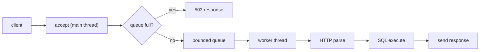

# 멀티스레드 SQL API 서버 설계 기록

이 프로젝트는 C로 구현한 멀티스레드 SQL API 서버입니다.  
이번 README는 기능 소개보다, 설계 과정에서 실제로 오래 고민했던 두 가지 질문에 답하는 문서로 다시 정리했습니다.

우리가 집중했던 질문은 아래 두 가지였습니다.

1. `worker thread` 수와 `bounded queue` 크기를 어떻게 정할 것인가
2. `worker thread`가 요청 처리의 어디까지 책임질 것인가

## 프로젝트 한눈에 보기

- 메인 스레드는 연결을 받고 `bounded queue`에 넣습니다.
- 워커 스레드는 큐에서 요청을 꺼내 HTTP 파싱, SQL 실행, 응답 전송까지 끝까지 처리합니다.
- 큐가 가득 차면 요청을 오래 붙잡지 않고 `503 Service Unavailable`로 빠르게 실패시킵니다.
- 저장 엔진은 테이블 단위 `pthread_rwlock_t`를 사용해 동시성을 제어합니다.



## 핵심 결론

- `worker` 수는 많을수록 좋은 것이 아니라, workload 특성에 맞는 적정값이 중요했습니다.
- `read-heavy` 환경에서는 worker를 늘려도 큰 차이가 없었습니다.
- `SELECT + INSERT`가 섞인 `mixed` 환경에서는 `workers=4`가 가장 안정적이었고, `workers=8`은 오히려 지연과 실패가 늘었습니다.
- 요청 하나를 더 무겁게 만들면 multi-worker 효과가 분명하게 나타났습니다.
- `bounded queue`는 너무 작으면 burst를 버티지 못하고, 너무 크면 늦게 실패하는 서버가 됩니다.
- 초기 실험에서는 `queue=48`이 좋아 보였지만, 요청 처리 시간을 더 키운 실험까지 포함하면 `queue=64` 쪽이 더 안정적이었습니다.
- 따라서 현재 설계 판단은 `queue=64`를 기본 후보로 두고, 매우 가벼운 workload에서는 `queue=48`도 사용할 수 있다는 것입니다.
- 구현 복잡도와 과제 범위를 고려해, 워커 하나가 요청 하나를 끝까지 처리하는 구조를 선택했습니다.

## 1. 왜 worker 수를 실험으로 정했는가

처음에는 worker를 많이 두면 무조건 유리할 것처럼 보였습니다. 하지만 실제로는 요청의 종류에 따라 결과가 달랐습니다.

### 1-1. Read-heavy workload

단순 조회가 많은 경우에는 worker 수를 늘려도 성능 차이가 크지 않았습니다.  
현재 조회 경로가 이미 가볍기 때문에, worker를 더 늘려도 처리량이 크게 오르지 않았습니다.

해석은 명확했습니다.

- 이 구간에서는 병렬성보다 요청 자체가 충분히 가벼운 것이 더 큰 요인이었습니다.
- multi-worker의 효과가 완전히 없는 것은 아니지만, throughput을 크게 끌어올릴 정도는 아니었습니다.

### 1-2. Mixed workload

조회와 저장이 함께 섞인 경우에는 결과가 달랐습니다.

- `workers=4`에서 throughput, p95, `503` 수가 가장 안정적이었습니다.
- `workers=8`까지 늘리면 오히려 lock contention, context switching, queue 대기가 커지면서 성능이 나빠졌습니다.

즉, worker를 늘리는 것이 항상 병렬성 증가로 이어지지는 않았고, 공유 자원 경쟁이 있는 workload에서는 오히려 독이 될 수 있었습니다.

### 1-3. 요청을 더 무겁게 만들었을 때

추가 실험으로 요청 하나에 더 많은 작업 시간을 넣어 보니, 그때는 multi-worker 효과가 확실히 드러났습니다.

이 결과는 중요한 메시지를 줬습니다.

- 기존 read path가 평평하게 보였던 이유는 multi-worker가 쓸모없어서가 아니라, 원래 작업이 너무 가벼웠기 때문입니다.
- 작업이 무거워질수록 worker 수의 의미가 커집니다.

### 1-4. worker 수에 대한 최종 판단

우리의 결론은 단순합니다.

- worker 수에는 모든 상황에 맞는 하나의 정답이 없습니다.
- 가벼운 조회 위주라면 worker를 많이 늘려도 이득이 제한적입니다.
- 읽기와 쓰기가 섞여 lock 경쟁이 생기는 workload에서는 sweet spot을 찾는 것이 중요합니다.
- 이번 실험 범위에서는 `mixed` workload 기준 `workers=4`가 가장 설득력 있는 선택이었습니다.

참고 문서:

- `docs/worker_benchmark_comparison.md`
- `docs/mixed_p95_presentation_note.md`

## 2. 왜 bounded queue 크기를 다시 실험했는가

queue 크기는 단순히 "클수록 좋다"로 결정할 수 없었습니다.

- 너무 작으면 짧은 burst도 흡수하지 못하고 바로 `503`이 늘어납니다.
- 너무 크면 실패는 줄어들 수 있어도, queue wait가 길어져 응답이 느려집니다.

즉, queue는 실패 수와 지연 시간 사이의 균형 문제였습니다.

### 2-1. 초기 관찰

처음 sweep에서는 `queue=48`이 가장 좋아 보였습니다.

- 작은 큐보다 `503`을 줄였고
- 너무 큰 큐처럼 tail latency를 크게 키우지도 않았기 때문입니다.

### 2-2. 추가 실험 후 판단 변화

하지만 요청 처리에 시간이 조금 더 걸리는 상황을 넣어 다시 보니, 결과 중심이 `48`에서 `64` 쪽으로 이동했습니다.

이 변화가 의미하는 바는 아래와 같습니다.

- baseline이 너무 가벼우면 queue 차이가 작게 보일 수 있습니다.
- workload가 조금만 무거워져도 queue가 더 많은 버퍼 역할을 해야 합니다.
- 그래서 실서비스에 가까운 보수적 선택은 `64`가 더 적절하다고 판단했습니다.

### 2-3. queue 크기에 대한 최종 판단

- 기본 권장값: `queue=64`
- 매우 가벼운 workload에서 고려 가능한 값: `queue=48`
- 피해야 할 방향:
  - 너무 작은 큐: burst에서 빠르게 `503` 증가
  - 너무 큰 큐: 응답을 오래 밀어두는 "늦게 실패하는 서버"

참고 문서:

- `docs/queue_size_experiment_results_20260422.md`
- `docs/queue_size_simulated_work_results_20260422.md`

## 3. 왜 worker가 요청을 끝까지 처리하게 했는가

두 번째로 오래 고민한 부분은 worker의 책임 범위였습니다.

선택지는 크게 두 가지였습니다.

1. 워커가 요청을 큐에서 꺼낸 뒤 HTTP 파싱, SQL 실행, 응답 전송까지 모두 처리한다.
2. HTTP 파싱, SQL 실행, 응답 전송을 별도의 스레드 단계로 분리한다.

우리는 첫 번째 구조를 선택했습니다.

### 이유

- 요청 처리 흐름이 단순합니다.
- `fd`와 메모리 소유권을 한 워커 안에서 관리할 수 있어 구현이 훨씬 명확합니다.
- 응답 전송을 별도 스레드로 분리하면 추가 큐, 추가 동기화, 추가 상태 전달이 필요합니다.
- 이번 과제 범위에서는 그 복잡도가 얻는 이익보다 더 컸습니다.

### 감수한 trade-off

- 느린 클라이언트가 있으면 worker가 잠시 묶일 수 있습니다.

하지만 이번 프로젝트에서는 아래 조건 때문에 이 단점을 감수할 수 있다고 판단했습니다.

- 응답 body가 크지 않습니다.
- DB lock은 응답 전송 전에 해제됩니다.
- 과제 범위에서는 구조 단순성이 유지보수성과 설명 가능성 면에서 더 중요했습니다.

정리하면, 우리는 "이론적으로 더 세분화된 구조"보다 "현재 범위에서 더 단순하고 명확한 구조"를 택했습니다.


## 5. 실행 방법

### 빌드

```bash
make
```

### 테스트

```bash
make tests
```

### 서버 실행 예시

```bash
./sql_processor --server 8080
```

실험 스크립트와 결과 정리 도구는 아래 경로에 있습니다.

- `scripts/run_queue_experiment.sh`
- `scripts/run_queue_clean_campaign.py`
- `scripts/run_queue_simwork_campaign.py`
- `scripts/summarize_queue_results.py`
- `scripts/summarize_queue_simwork_results.py`

## 6. 저장소에서 보면 좋은 파일

- `src/server.c`: accept, bounded queue, worker thread, overload 처리의 핵심 구현
- `src/table_runtime.c`: 테이블 단위 `pthread_rwlock_t` 기반 동시성 제어
- `docs/worker_benchmark_comparison.md`: worker 수 비교 실험 정리
- `docs/queue_size_experiment_results_20260422.md`: queue 크기 실험 결과
- `docs/queue_size_simulated_work_results_20260422.md`: simulated work를 추가한 queue 실험 결과

## 마무리

이번 프로젝트에서 가장 중요했던 배움은 두 가지였습니다.

- 서버 설정값은 감으로 정하는 것이 아니라 workload를 기준으로 실험해 정해야 한다.
- 더 복잡한 구조가 항상 더 좋은 구조는 아니며, 현재 범위에서 설명 가능하고 유지 가능한 단순함이 더 중요할 수 있다.

그래서 우리는 `worker/queue`를 실험으로 조정했고, 최종적으로는 워커 하나가 요청 하나를 끝까지 책임지는 단순한 구조를 선택했습니다.
