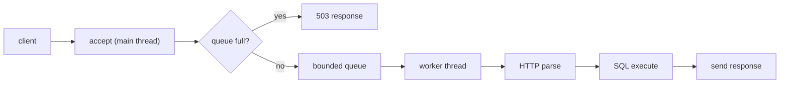

# 멀티스레드 SQL API 서버

이 프로젝트는 C로 구현한 멀티스레드 SQL API 서버입니다.  

## 프로젝트 한눈에 보기

- 메인 스레드는 연결을 받고 `bounded queue`에 넣습니다.
- 워커 스레드는 큐에서 요청을 꺼내 HTTP 파싱, SQL 실행, 응답 전송까지 끝까지 처리합니다.
- 큐가 가득 차면 요청을 오래 붙잡지 않고 `503 Service Unavailable`로 빠르게 실패시킵니다.
- 저장 엔진은 테이블 단위 `pthread_rwlock_t`를 사용해 동시성을 제어합니다.



## 1. worker 스레드와 bounded queue 크기 설정

## 2. worker 스레드의 책임 범위

## 3. 중간 상태 노출 문제


## 4. 실행 방법

### 빌드

```bash
make
```

### 테스트

```bash
make tests
```

### 서버 실행 예시

```bash
./sql_processor --server 8080
```

실험 스크립트와 결과 정리 도구는 아래 경로에 있습니다.

- `scripts/run_queue_experiment.sh`
- `scripts/run_queue_clean_campaign.py`
- `scripts/run_queue_simwork_campaign.py`
- `scripts/summarize_queue_results.py`
- `scripts/summarize_queue_simwork_results.py`

## 5. 저장소에서 보면 좋은 파일

- `src/server.c`: accept, bounded queue, worker thread, overload 처리의 핵심 구현
- `src/table_runtime.c`: 테이블 단위 `pthread_rwlock_t` 기반 동시성 제어
- `docs/worker_benchmark_comparison.md`: worker 수 비교 실험 정리
- `docs/queue_size_experiment_results_20260422.md`: queue 크기 실험 결과
- `docs/queue_size_simulated_work_results_20260422.md`: simulated work를 추가한 queue 실험 결과

## 마무리

이번 프로젝트에서 가장 중요했던 배움은 두 가지였습니다.

- 서버 설정값은 감으로 정하는 것이 아니라 workload를 기준으로 실험해 정해야 한다.
- 더 복잡한 구조가 항상 더 좋은 구조는 아니며, 현재 범위에서 설명 가능하고 유지 가능한 단순함이 더 중요할 수 있다.

그래서 우리는 `worker/queue`를 실험으로 조정했고, 최종적으로는 워커 하나가 요청 하나를 끝까지 책임지는 단순한 구조를 선택했습니다.
