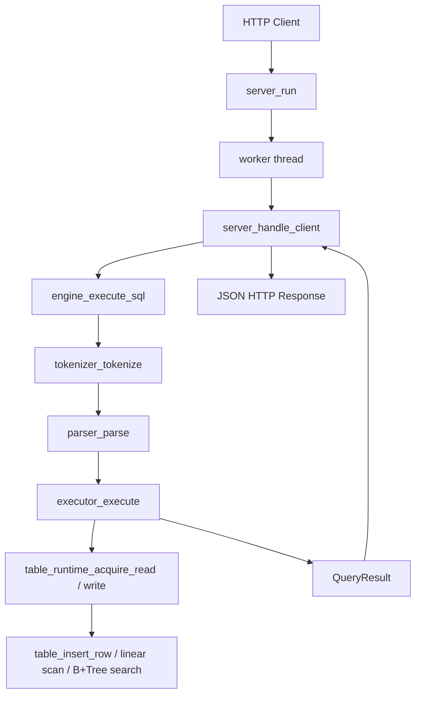
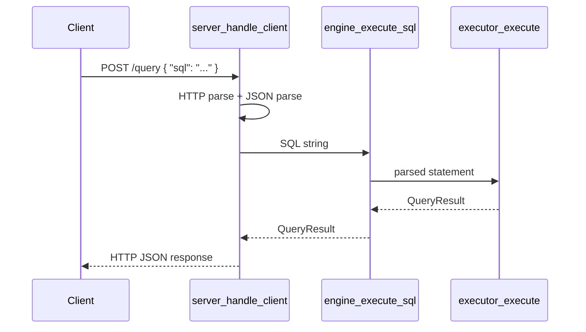
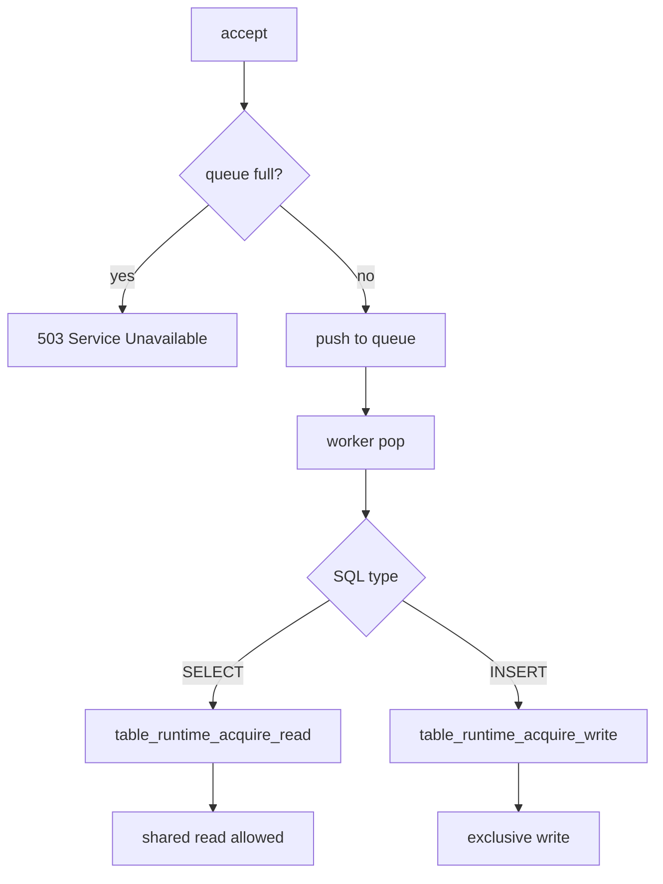
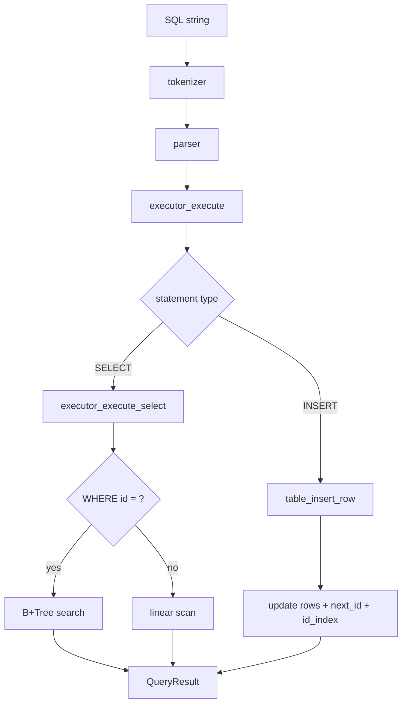

# KM Branch Top-Down Core Guide

## 목적

이 문서는 `origin/km` 브랜치 기준으로 `goal.md` 의 핵심 목표를 **top-down으로 빠르게 이해하기 위한 단일 문서**다.

이 문서는 아래 3가지만 설명한다.

1. API 서버와 DB 엔진이 어떻게 연결되는가
2. 멀티스레드 요청을 어떻게 안전하게 처리하는가
3. 기존 SQL 처리기와 B+Tree 인덱스를 어떻게 재사용하는가

이 문서는 의도적으로 많은 것을 버린다.

- 모든 함수 설명
- storage/persistence 세부 구현
- benchmark 코드
- 보조 헬퍼 함수

핵심 함수 8개만 따라간다.

---

## 읽는 법

이 문서는 아래 순서로 읽으면 된다.

1. 전체 구조 그림
2. 핵심 3주제 요약
3. 주제별 핵심 함수와 Mermaid
4. 각 함수 의사코드
5. 설계 규칙과 테스트 대응표

문서를 다 읽고 나면 최소한 아래 질문에 답할 수 있어야 한다.

- HTTP 요청이 어떻게 SQL 실행으로 바뀌는가
- 왜 `read lock` 과 `write lock` 이 분리돼야 하는가
- 기존 tokenizer/parser/B+Tree 가 어디서 재사용되는가

---

## 핵심 3주제 요약

## 1. API 서버와 DB 엔진의 연결

핵심은 서버와 엔진의 역할을 분리하는 것이다.

- 서버는 HTTP 요청을 읽고 SQL 문자열을 꺼낸다.
- 엔진은 SQL 문자열을 받아 실행하고 구조화된 결과를 돌려준다.
- 서버는 그 결과를 다시 JSON/HTTP 응답으로 바꾼다.

이 주제를 이해하려면 아래 2개 함수만 보면 된다.

- `src/server.c` 의 `server_handle_client()`
- `src/engine.c` 의 `engine_execute_sql()`

## 2. 멀티스레드 동시성 처리

핵심은 “요청 병렬 처리”와 “데이터 보호”를 분리해서 보는 것이다.

- 서버는 worker thread 와 queue 로 요청을 병렬 처리한다.
- DB 엔진은 테이블 단위 락으로 같은 테이블 접근을 보호한다.
- 읽기는 같이 허용하고, 쓰기는 배타적으로 처리한다.

이 주제를 이해하려면 아래 3개 함수만 보면 된다.

- `src/server.c` 의 `server_run()`
- `src/table_runtime.c` 의 `table_runtime_acquire_read()`
- `src/table_runtime.c` 의 `table_runtime_acquire_write()`

## 3. 기존 SQL 처리기와 인덱스 재사용

핵심은 “서버를 새로 만들었지만 DB 엔진은 기존 SQL 처리 파이프라인을 그대로 쓴다”는 점이다.

- SQL 문자열은 tokenizer -> parser -> executor 순서로 간다.
- `SELECT WHERE id = ?` 는 B+Tree 인덱스를 사용할 수 있다.
- `INSERT` 는 row 저장과 동시에 id index 를 갱신한다.

이 주제를 이해하려면 아래 3개 함수만 보면 된다.

- `src/executor.c` 의 `executor_execute()`
- `src/executor.c` 의 `executor_execute_select()`
- `src/table_runtime.c` 의 `table_insert_row()`

---

## 전체 구조



이 그림의 핵심 해석은 한 줄이다.

> 서버는 요청/응답을 담당하고, 엔진은 SQL 실행만 담당한다.

---

## 주제 1. API 서버와 DB 엔진의 연결

### 꼭 봐야 할 함수

| 파일 | 함수 | 한 줄 역할 |
| --- | --- | --- |
| `src/server.c` | `server_handle_client()` | HTTP 요청을 읽고 SQL을 추출해 엔진을 호출한 뒤 응답을 만든다. |
| `src/engine.c` | `engine_execute_sql()` | SQL 문자열을 tokenizer/parser/executor 로 연결하는 엔진 단일 진입점이다. |

### 이 주제에서 바뀐 설계

- 서버가 SQL 문법을 직접 실행하지 않는다.
- 엔진은 HTTP status code, header, socket 을 모른다.
- 서버와 엔진 사이의 계약은 `SQL string -> QueryResult` 다.

### 이해용 그림



### 핵심 함수 의사코드

#### `server_handle_client()`

```text
요청 바이트를 읽는다
HTTP request line을 파싱한다
JSON body에서 sql 문자열을 추출한다
QueryResult를 초기화한다
engine_execute_sql(sql, &result)를 호출한다
result를 JSON 문자열로 직렬화한다
status code를 결정한다
HTTP 응답을 전송한다
```

#### `engine_execute_sql()`

```text
출력 QueryResult를 초기화한다
SQL 문자열이 비었는지 확인한다
tokenizer_tokenize로 토큰 배열을 만든다
parser_parse로 SqlStatement를 만든다
executor_execute로 statement를 실행한다
성공하면 QueryResult를 반환한다
실패하면 error를 채운 뒤 반환한다
```

---

## 주제 2. 멀티스레드 동시성 처리

### 꼭 봐야 할 함수

| 파일 | 함수 | 한 줄 역할 |
| --- | --- | --- |
| `src/server.c` | `server_run()` | listener, worker thread, queue, shutdown 전체 구조를 만든다. |
| `src/table_runtime.c` | `table_runtime_acquire_read()` | 같은 테이블 읽기 요청에 read lock 을 건다. |
| `src/table_runtime.c` | `table_runtime_acquire_write()` | 같은 테이블 쓰기 요청에 write lock 을 건다. |

### 이 주제에서 바뀐 설계

- 요청마다 새 스레드를 만드는 대신 thread pool 을 둔다.
- queue 는 bounded queue 로 제한한다.
- DB 락은 전역 락이 아니라 테이블 단위로 둔다.
- read miss 는 새 테이블 엔트리를 만들지 않는다.
- write path 만 필요 시 새 테이블을 만든다.

### 이해용 그림



### 핵심 함수 의사코드

#### `server_run()`

```text
요청 queue를 초기화한다
listen socket을 만든다
worker thread 8개를 생성한다
accept loop를 돈다
새 연결이 오면 queue에 넣는다
queue가 가득 차면 503을 즉시 응답한다
종료 신호가 오면 listener를 닫는다
queue shutdown 후 worker join을 수행한다
```

#### `table_runtime_acquire_read()`

```text
table name으로 registry에서 엔트리를 찾는다
없는 테이블이면 실패한다
찾은 엔트리에 read lock을 건다
handle에 entry를 담아 반환한다
```

#### `table_runtime_acquire_write()`

```text
table name으로 registry에서 엔트리를 찾는다
없으면 새 엔트리를 만든다
찾은 엔트리에 write lock을 건다
handle에 entry를 담아 반환한다
```

---

## 주제 3. 기존 SQL 처리기와 인덱스 재사용

### 꼭 봐야 할 함수

| 파일 | 함수 | 한 줄 역할 |
| --- | --- | --- |
| `src/executor.c` | `executor_execute()` | statement type 에 따라 INSERT/SELECT/DELETE 경로를 나눈다. |
| `src/executor.c` | `executor_execute_select()` | SELECT가 read lock, projection, scan/index 조회를 통해 결과를 만든다. |
| `src/table_runtime.c` | `table_insert_row()` | INSERT가 row 저장과 id index 갱신으로 이어진다. |

### 이 주제에서 바뀐 설계

- 기존 tokenizer/parser 를 그대로 사용한다.
- executor는 직접 출력하지 않고 `QueryResult` 를 채운다.
- B+Tree 인덱스는 `id equality select` 에서 활용한다.
- row 저장과 index 갱신은 같은 write 경로 안에서 처리된다.

### 이해용 그림



### 핵심 함수 의사코드

#### `executor_execute()`

```text
출력 QueryResult를 초기화한다
statement type을 확인한다
INSERT면 executor_execute_insert를 호출한다
SELECT면 executor_execute_select를 호출한다
DELETE면 현재는 실패를 반환한다
지원하지 않는 타입이면 실패를 반환한다
```

#### `executor_execute_select()`

```text
read lock으로 테이블을 연다
projection 정보를 준비한다
WHERE가 없으면 전체 scan을 한다
WHERE id = 값 이면 B+Tree search를 시도한다
그 외에는 linear scan을 한다
조회한 row를 QueryResult용 메모리로 복사한다
lock을 해제하고 결과를 반환한다
```

#### `table_insert_row()`

```text
테이블 스키마가 없으면 첫 INSERT로 초기화한다
기존 스키마가 있으면 INSERT schema를 검증한다
row 저장 공간을 확보한다
next_id를 사용해 새 row를 만든다
rows 배열에 row를 넣는다
B+Tree id index에 (id -> row_index)를 넣는다
row_count와 next_id를 증가시킨다
```

---

## 핵심 설계 규칙

이 구현을 이해할 때 반드시 머리에 둬야 하는 규칙만 추리면 아래와 같다.

- 서버는 HTTP를 알고, 엔진은 HTTP를 모른다.
- 엔진의 유일한 공개 계약은 `SQL string -> QueryResult` 다.
- `SELECT` 는 read lock, `INSERT` 는 write lock을 쓴다.
- 없는 테이블에 대한 read는 새 엔트리를 만들지 않는다.
- 없는 테이블에 대한 write는 필요 시 새 엔트리를 만든다.
- `SELECT WHERE id = ?` 는 B+Tree 인덱스를 사용할 수 있다.
- 결과는 `QueryResult` 로 복사한 뒤 반환한다.

---

## 테스트 대응표

이 문서에서 설명한 설계가 실제로 어디서 검증되는지 최소 대응만 정리하면 아래와 같다.

| 확인하고 싶은 것 | 보면 되는 테스트 |
| --- | --- |
| same-table read/read | `tests/test_engine_concurrency.c` |
| same-table read/write | `tests/test_engine_concurrency.c` |
| same-table write/write | `tests/test_engine_concurrency.c` |
| cross-table isolation | `tests/test_engine_concurrency.c` |
| missing table read flood | `tests/test_engine_concurrency.c` |
| executor가 index를 쓰는지 | `tests/test_executor.c` |
| table runtime이 multi-table state를 유지하는지 | `tests/test_table_runtime.c` |

---

## 최소 읽기 순서

정말 시간 없으면 아래 순서만 따르면 된다.

1. `src/main.c` 의 `main()`
2. `src/server.c` 의 `server_run()`
3. `src/server.c` 의 `server_handle_client()`
4. `src/engine.c` 의 `engine_execute_sql()`
5. `src/executor.c` 의 `executor_execute()`
6. `src/executor.c` 의 `executor_execute_select()`
7. `src/table_runtime.c` 의 `table_runtime_acquire_read()`
8. `src/table_runtime.c` 의 `table_runtime_acquire_write()`
9. `src/table_runtime.c` 의 `table_insert_row()`
10. `tests/test_engine_concurrency.c`

이 10개만 따라가면 `goal.md` 의 핵심은 설명 가능하다.
