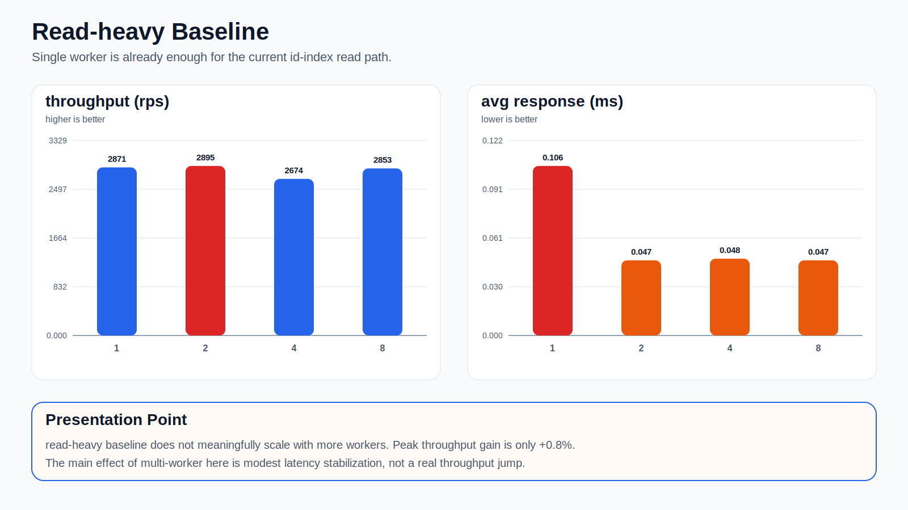
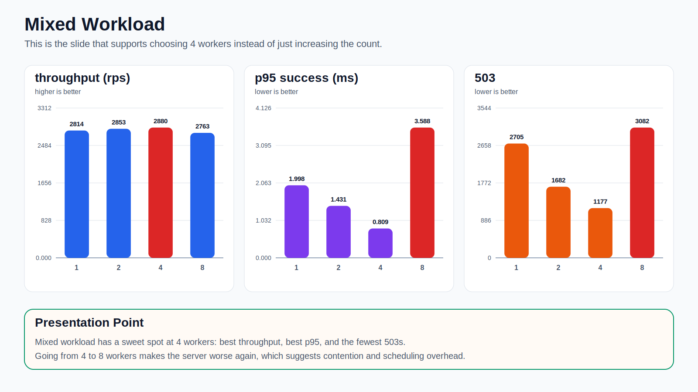
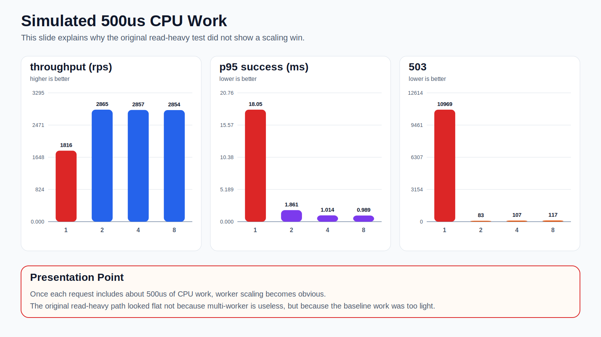

# Worker Benchmark Presentation Assets

발표에서는 아래 3장만 쓰는 구성이 가장 자연스럽다.

## Read-heavy Baseline: Throughput Barely Changes

포인트: 현재 read-heavy baseline은 이미 너무 가벼워서 worker 수를 늘려도 처리량이 거의 안 오른다.

## Mixed Workload: 4 Workers Is the Sweet Spot

포인트: mixed workload에서는 4 workers가 최적점이다. 8로 늘리면 오히려 성능이 악화된다.

## Heavier Workload: Multi-worker Benefit Becomes Obvious

포인트: 요청당 일을 더 무겁게 만들면 multi-worker의 가치가 확실히 드러난다.

