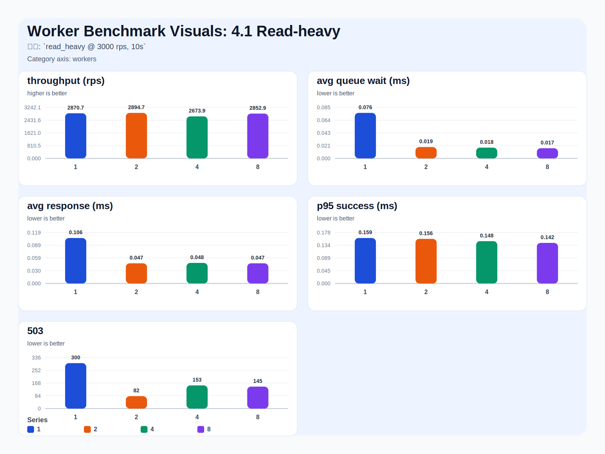
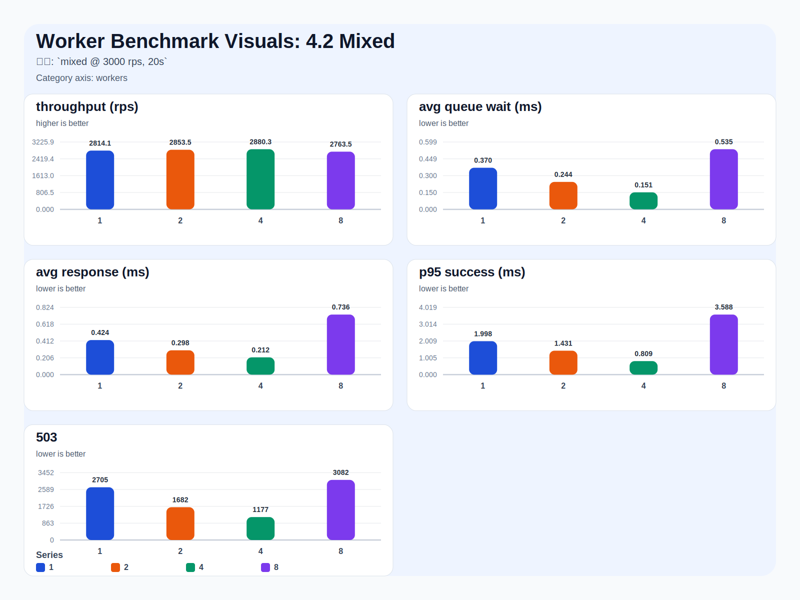
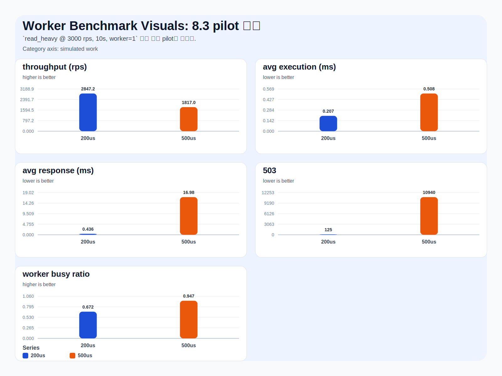
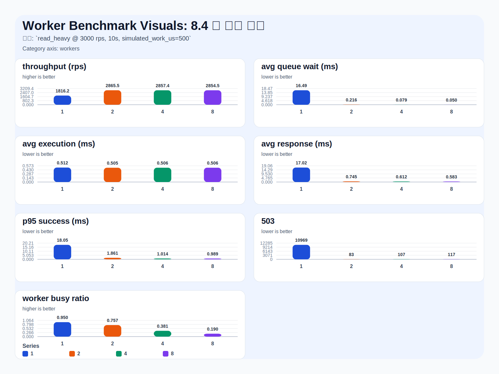

# Worker Benchmark Visual Assets

발표용으로 바로 사용할 수 있도록 Markdown 표를 SVG 그래프로 변환한 결과다.

## 4.1 Read-heavy

조건: `read_heavy @ 3000 rps, 10s`

## 4.2 Mixed

조건: `mixed @ 3000 rps, 20s`

## 8.3 pilot 결과

`read_heavy @ 3000 rps, 10s, worker=1` 에서 먼저 pilot을 돌렸다.

## 8.4 본 실험 결과

조건: `read_heavy @ 3000 rps, 10s, simulated_work_us=500`

